<div dir="rtl">

<div align="center">

<a href="https://eduflow-lf-2.vercel.app/ar"></a>

# EduFlow

**تعلّم البرمجة وتحليل البيانات والتصميم مجانًا، من متصفحك، بالعربية أو الإنجليزية.**

16 دورة · 303 درسًا مكتوبًا · 297 تمرينًا عمليًا · 1,630 سؤالًا · يعمل دون إنترنت

[](https://eduflow-lf-2.vercel.app/ar)
[](https://eduflow-lf-2.vercel.app)

[Read this in English](README.md)

<br>

<a href="https://eduflow-lf-2.vercel.app/ar">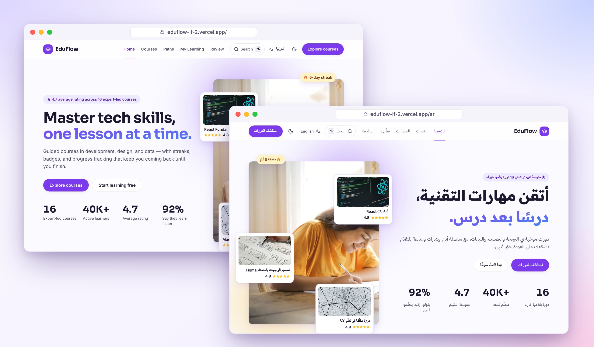</a>

</div>

## لماذا EduFlow؟

- **دروس مكتوبة لتُقرأ وتُفهم.** كل درس بين 600 و1,200 كلمة، فيه أمثلة محلولة وكود ملوّن ورسوم توضيحية، مع الأخطاء الشائعة والخلاصة. لا فيديوهات طويلة تنتظر انتهاءها.
- **تتدرّب داخل الصفحة نفسها.** محرّر لـ React وHTML وCSS وJavaScript يفحص حلّك تلقائيًا، و**SQLite** حقيقية لدورة SQL، و**Python مع pandas وscikit-learn** لدورات البيانات، وتحديات أنواع في TypeScript، وتمارين تكتب فيها الاختبارات بنفسك. بلا أي تثبيت.
- **يساعدك على التذكّر.** كل اختيار في كل اختبار يشرح لماذا هو صحيح أو خطأ، والمصطلحات التي تعلّمتها تعود إليك بطاقاتٍ للمراجعة المتباعدة.
- **يشجّعك على الاستمرار.** سلسلة أيام متتالية، وهدف أسبوعي، ونقاط خبرة ومستويات، و26 شارة، وإحصاءات، وشهادة في النهاية.
- **بياناتك ملكك.** لا حساب ولا تتبّع؛ تقدّمك محفوظ في متصفحك، ويمكنك تصديره أو استعادته أو حذفه. يعمل دون إنترنت، بالعربية والإنجليزية، بالوضعين الفاتح والداكن.

<p align="center">
  
</p>

## ماذا يمكنك أن تتعلّم؟

| الدورة | المسار | المستوى | الدروس | تتدرّب بـ |
|---|---|---|---:|---|
| [أساسيات JavaScript](https://eduflow-lf-2.vercel.app/ar/courses/javascript-fundamentals) | الويب | مبتدئ | 22 | محرّر JavaScript وDOM |
| [أساسيات React](https://eduflow-lf-2.vercel.app/ar/courses/react-fundamentals) | الويب | مبتدئ | 18 | محرّر React مباشر |
| [إتقان CSS الحديثة](https://eduflow-lf-2.vercel.app/ar/courses/css-mastery) | الويب | متوسط | 20 | محرّر HTML وCSS |
| [إمكانية الوصول للويب عمليًا](https://eduflow-lf-2.vercel.app/ar/courses/web-accessibility) | الويب | متوسط | 18 | محرّر DOM ومراجعات موجَّهة |
| [اختبار تطبيقات JavaScript](https://eduflow-lf-2.vercel.app/ar/courses/testing-javascript) | الويب | متوسط | 18 | تكتب الاختبارات ويجب أن تكشف أخطاءً مزروعة |
| [أنماط TypeScript المتقدّمة](https://eduflow-lf-2.vercel.app/ar/courses/advanced-typescript) | الويب | متقدم | 22 | تحديات أنواع يفحصها المترجم الحقيقي |
| [Python لتحليل البيانات](https://eduflow-lf-2.vercel.app/ar/courses/python-data-analysis) | البيانات | مبتدئ | 24 | Python وpandas في المتصفح |
| [SQL للمحلّلين](https://eduflow-lf-2.vercel.app/ar/courses/sql-for-analysts) | البيانات | متوسط | 16 | SQLite على قاعدة بيانات متجر واقعية |
| [دورة مكثّفة في تعلّم الآلة](https://eduflow-lf-2.vercel.app/ar/courses/ml-crash-course) | الذكاء الاصطناعي | متوسط | 23 | Python وscikit-learn في المتصفح |
| [تصميم الواجهات باستخدام Figma](https://eduflow-lf-2.vercel.app/ar/courses/figma-ui-design) | التصميم | مبتدئ | 17 | تمارين تصميم موجَّهة |
| [أنظمة تصميم تكبر مع فريقك](https://eduflow-lf-2.vercel.app/ar/courses/design-systems) | التصميم | متقدم | 19 | Tokens في محرّر CSS وتمارين موجَّهة |
| [بناء تطبيقات الجوّال باستخدام React Native](https://eduflow-lf-2.vercel.app/ar/courses/react-native-apps) | الجوال | متوسط | 21 | محرّر JavaScript وتمارين موجَّهة |
| [أساسيات Swift لتطبيقات iOS](https://eduflow-lf-2.vercel.app/ar/courses/swift-essentials) | الجوال | مبتدئ | 15 | تمارين موجَّهة |
| [Git وGitHub](https://eduflow-lf-2.vercel.app/ar/courses/git-github) | DevOps والسحابة | مبتدئ | 16 | تمارين موجَّهة |
| [Docker وKubernetes: انشر وأنت مطمئن](https://eduflow-lf-2.vercel.app/ar/courses/docker-kubernetes) | DevOps والسحابة | متوسط | 20 | تمارين موجَّهة |
| [أساسيات AWS السحابية](https://eduflow-lf-2.vercel.app/ar/courses/aws-cloud-foundations) | DevOps والسحابة | مبتدئ | 14 | تمارين موجَّهة |

لا تعرف من أين تبدأ؟ جرّب [اختبار تحديد المستوى](https://eduflow-lf-2.vercel.app/ar/placement)، أو اتبع **مسار تعلّم**: تطوير الواجهات الأمامية، أو تحليل البيانات، أو تصميم المنتجات، أو تطوير تطبيقات الجوال، أو هندسة الحوسبة السحابية، أو هندسة تعلّم الآلة.

> كل الدورات مجانية. الأسعار والتقييمات وأعداد المتعلّمين في الكتالوج جزء من واجهة المتجر التجريبية، ولن يُطلب منك الدفع أبدًا.

## جولة مصوّرة

### دروس تتعلّم منها فعلًا

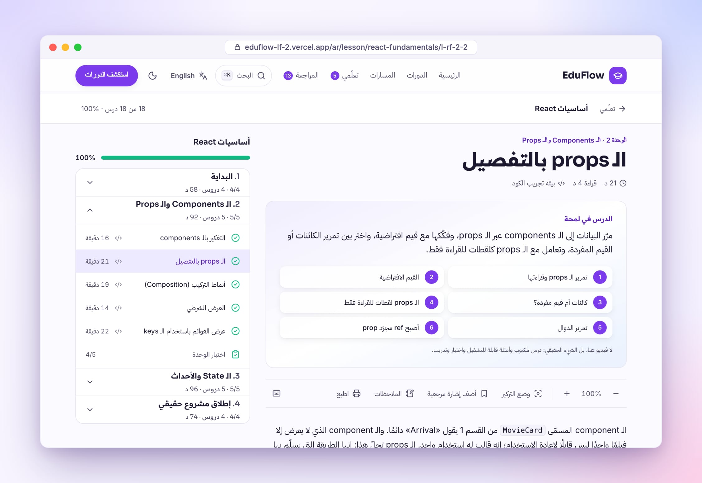

كل درس وكل اختبار وكل تمرين متاح بالعربية، والاتجاه من اليمين إلى اليسار، بينما يبقى الكود من اليسار إلى اليمين. يمكنك تكبير الخط، وتفعيل وضع التركيز، ووضع إشارة مرجعية، وكتابة ملاحظاتك، والطباعة. ويتذكّر EduFlow أين توقفت عن القراءة.

### تدرّب حقيقي داخل الصفحة

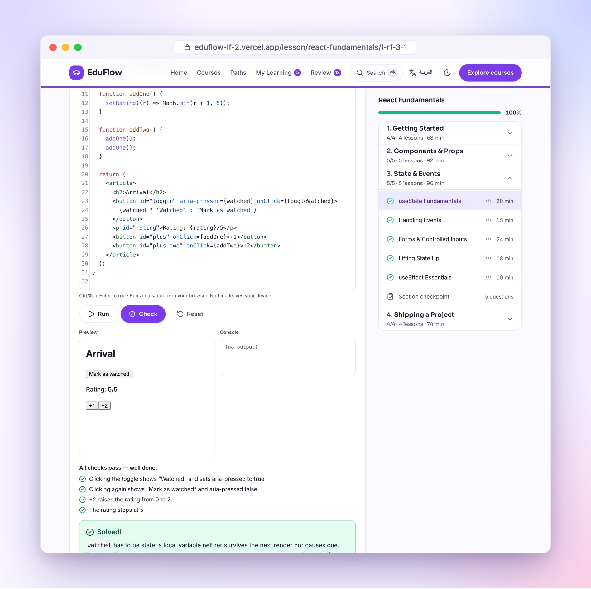

<table>
  <tr>
    <td width="50%">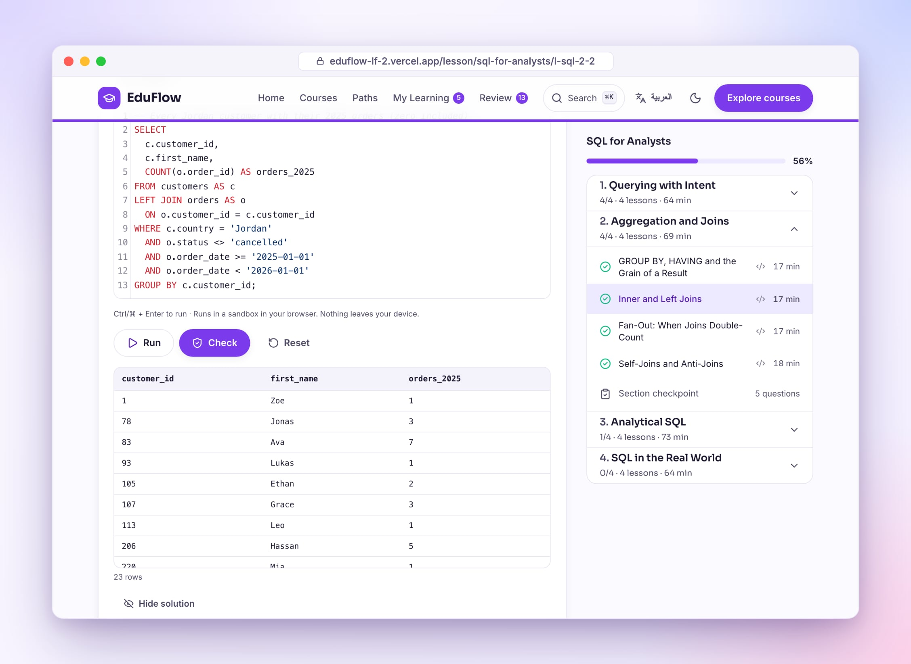<br><b>SQL</b> يعمل في SQLite داخل متصفحك على قاعدة بيانات متجر فيها عملاء وطلبات ومنتجات.</td>
    <td width="50%">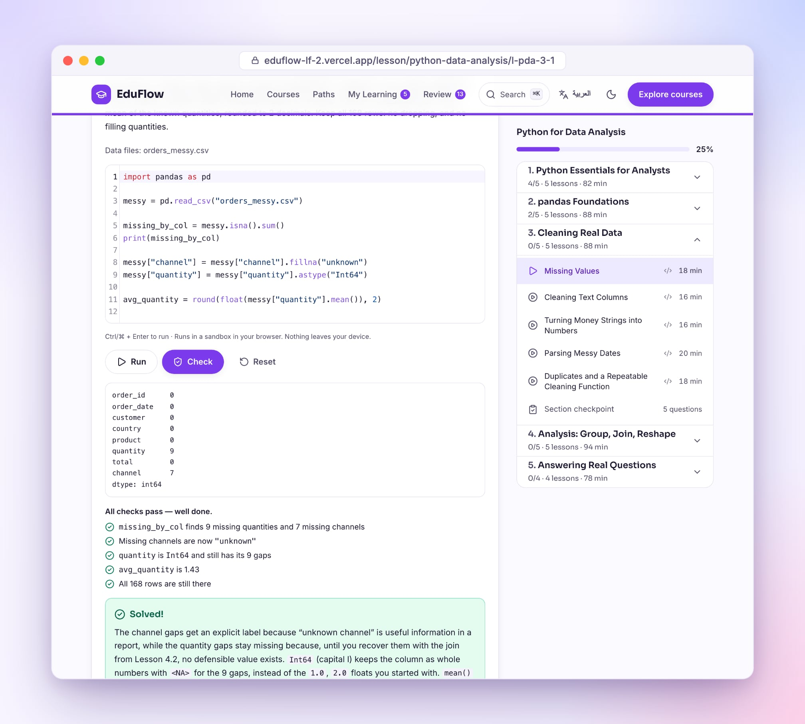<br><b>Python</b> مع pandas وscikit-learn يعمل في متصفحك، ويعمل دون إنترنت بعد أول تشغيل.</td>
  </tr>
</table>

لكل تمرين تلميحات، وحلّ نموذجي مع شرحه، وفحوص تخبرك بالضبط بما لم يكتمل بعد. يُحفظ الكود وأنت تكتب، ويعمل كله في بيئة معزولة: لا يغادر جهازك شيء، والحلقة اللانهائية تتوقف برسالة خطأ بدل أن تجمّد الصفحة.

### اختبارات تُعلّم، وبطاقات تثبّت المعلومة

<table>
  <tr>
    <td width="50%">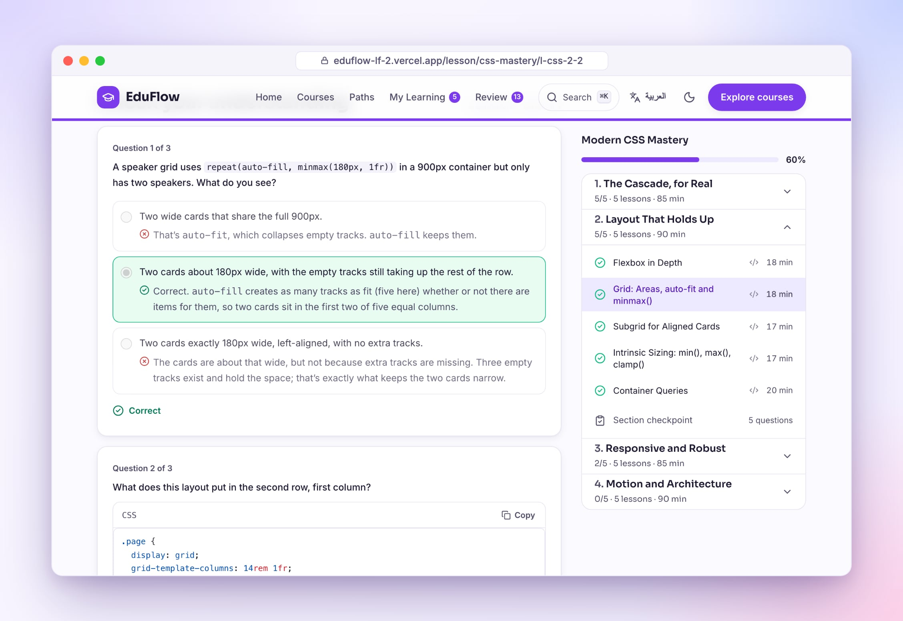<br>اختبار في نهاية كل درس، ومراجعة بعد كل وحدة، واختبار نهائي لكل دورة. <b>كل اختيار يشرح لماذا هو صحيح أو خطأ.</b></td>
    <td width="50%">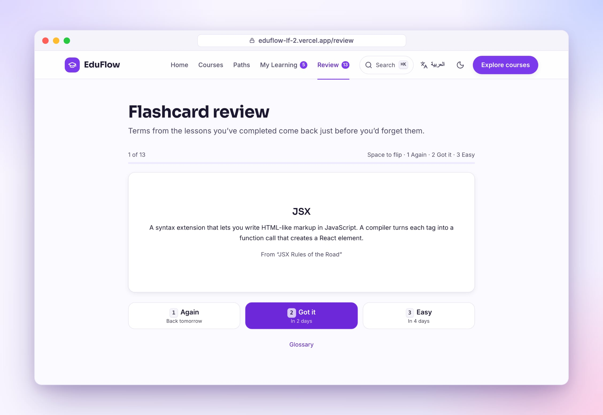<br>مصطلحات الدروس التي أنهيتها تتحوّل إلى <b>بطاقات مراجعة</b> تعود إليك قبل أن تنساها بقليل.</td>
  </tr>
</table>

### حافز يومي للاستمرار

<table>
  <tr>
    <td width="50%">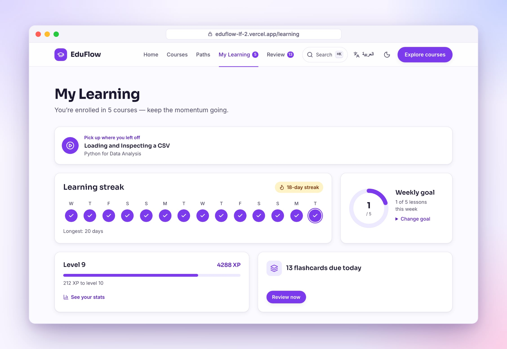<br>سلسلة الأيام، والهدف الأسبوعي، والمستوى، وما يجب مراجعته اليوم</td>
    <td width="50%">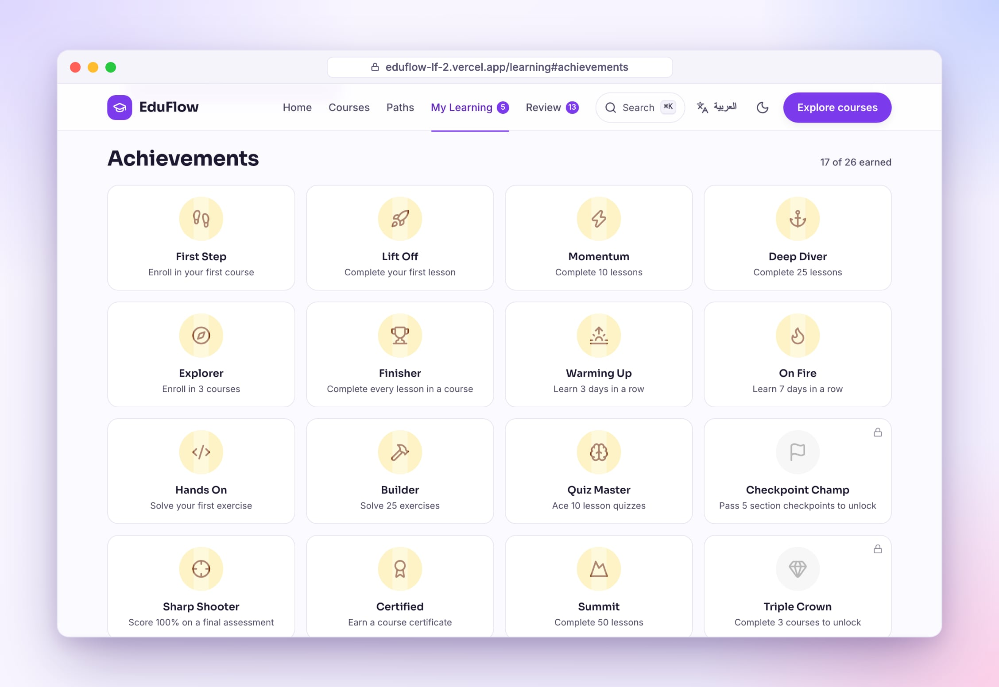<br>26 شارة تكسبها مما تفعله فعلًا</td>
  </tr>
  <tr>
    <td width="50%">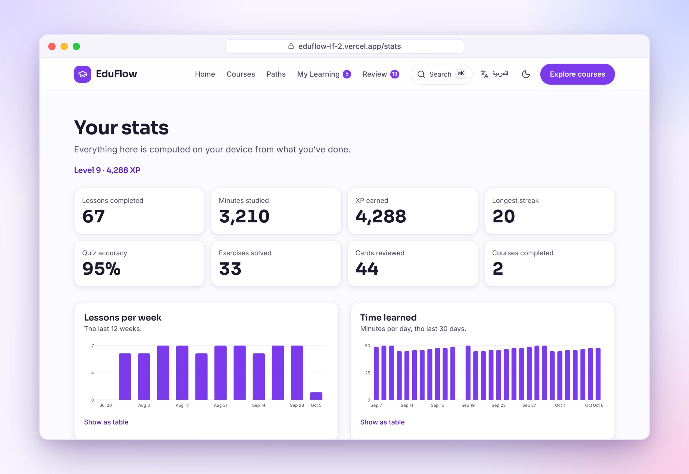<br>إحصاءاتك برسوم بيانية يمكن قراءتها جداول أيضًا</td>
    <td width="50%">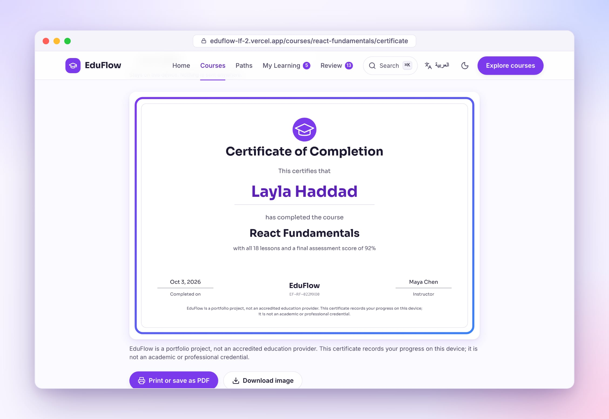<br>شهادة عند إنهاء كل الدروس واجتياز الاختبار النهائي</td>
  </tr>
</table>

### على كل الشاشات، فاتحًا وداكنًا

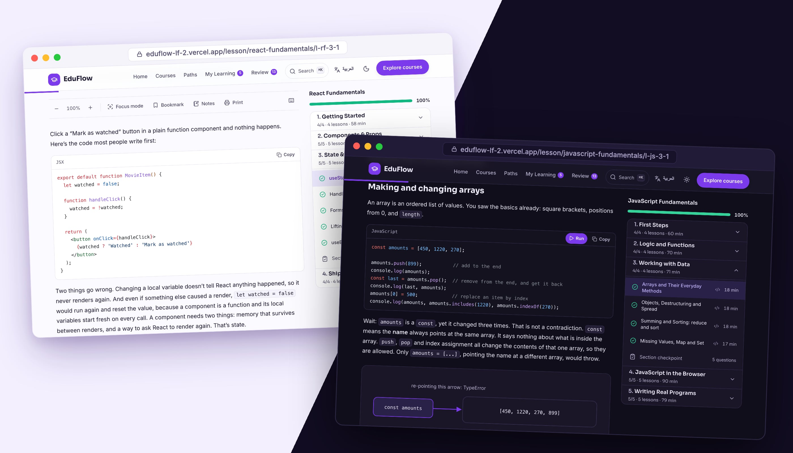

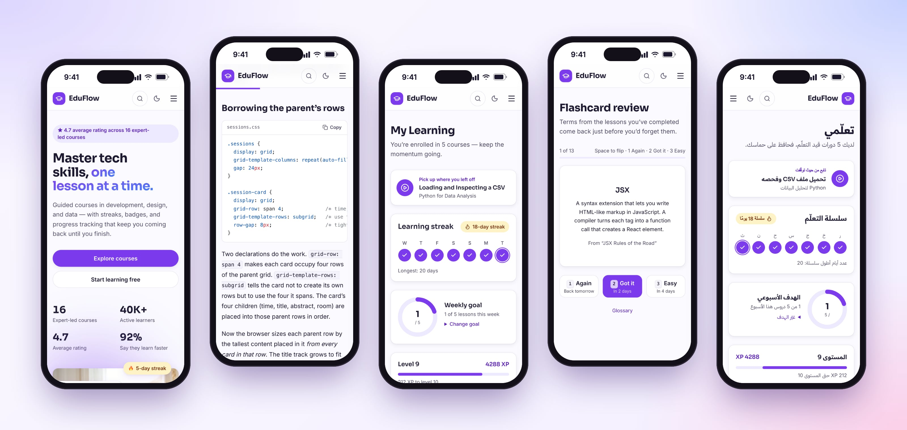

ثبّته كتطبيق على جهازك، واضغط «نزّلها للاستخدام دون إنترنت» في صفحة أي دورة لتعمل كل دروسها في أي مكان.

## بياناتك ملكك

لا حسابات ولا خوادم ولا أدوات تحليل. اشتراكاتك وتقدّمك وملاحظاتك وبطاقاتك محفوظة في متصفحك، ومن [صفحة الخصوصية](https://eduflow-lf-2.vercel.app/ar/privacy) تستطيع تصدير كل شيء في ملف، أو استعادته على جهاز آخر، أو حذفه بالكامل.

## بالأرقام

| | |
|---|---|
| الدورات | 16 في 6 مسارات |
| الدروس | 303، نحو 216 ألف كلمة بالإنجليزية و194 ألفًا بالعربية |
| الأسئلة | 1,073 في اختبارات الدروس + 365 في مراجعات الوحدات + 192 في الاختبارات النهائية |
| التمارين | 297، إضافة إلى 300 مثال كود قابل للتشغيل داخل الدروس |
| المصطلحات | 478 مصطلحًا، وهي نفسها بطاقات المراجعة |
| الاختبارات البرمجية | 106 اختبارات وحدة ومحتوى، و229 اختبارًا شاملًا مع فحص الإتاحة (حاسوب وجوال، باللغتين وبالوضعين)، وكل تمرين قابل للتشغيل يُحلّ فعليًا |

## التشغيل محليًا

تحتاج Node.js بالإصدار 20.19 أو أحدث.

<div dir="ltr">

```bash
git clone https://github.com/Ziad-AlHusseiny/eduflow.git
cd eduflow
npm ci
npm run dev
```

</div>

تفاصيل الأوامر والبنية التقنية في [الـ README الإنجليزي](README.md#under-the-hood).

## وجدت خطأً في درس؟

[افتح Issue](https://github.com/Ziad-AlHusseiny/eduflow/issues) واكتب رابط الدرس وما الخطأ. مصادر الدروس ملفات Markdown عادية في مجلد `content/`.

## شكر وتنويه

الصور من Unsplash وPexels، وحقوق الخطوط والبرمجيات مذكورة في [docs/CREDITS.md](docs/CREDITS.md). المدرّسون والتقييمات وأعداد المتعلّمين داخل التطبيق خيالية. EduFlow ليس جهة تعليمية معتمدة، وشهاداته ليست مؤهلات أكاديمية.

من تطوير [زياد الحسيني](https://github.com/Ziad-AlHusseiny).

</div>
