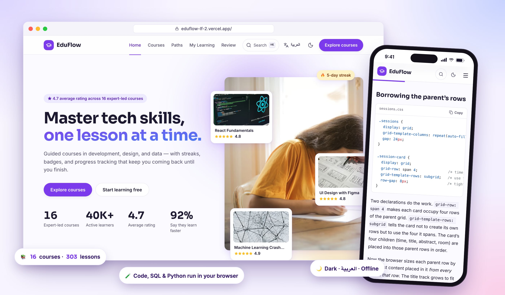
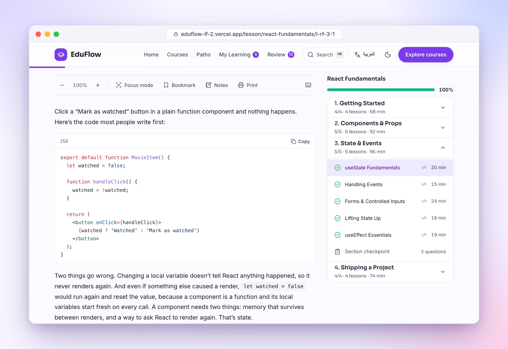
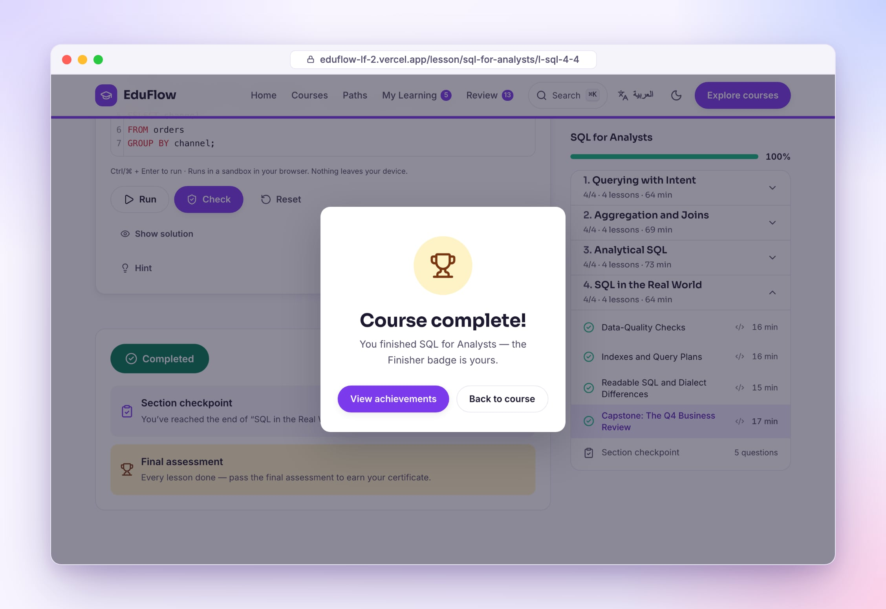
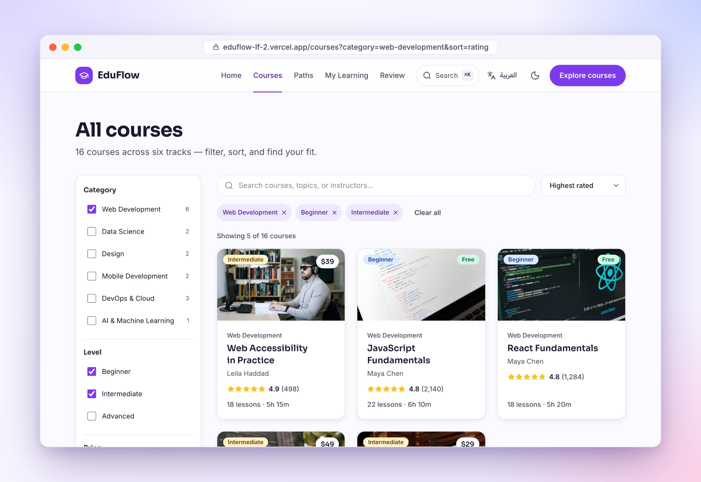
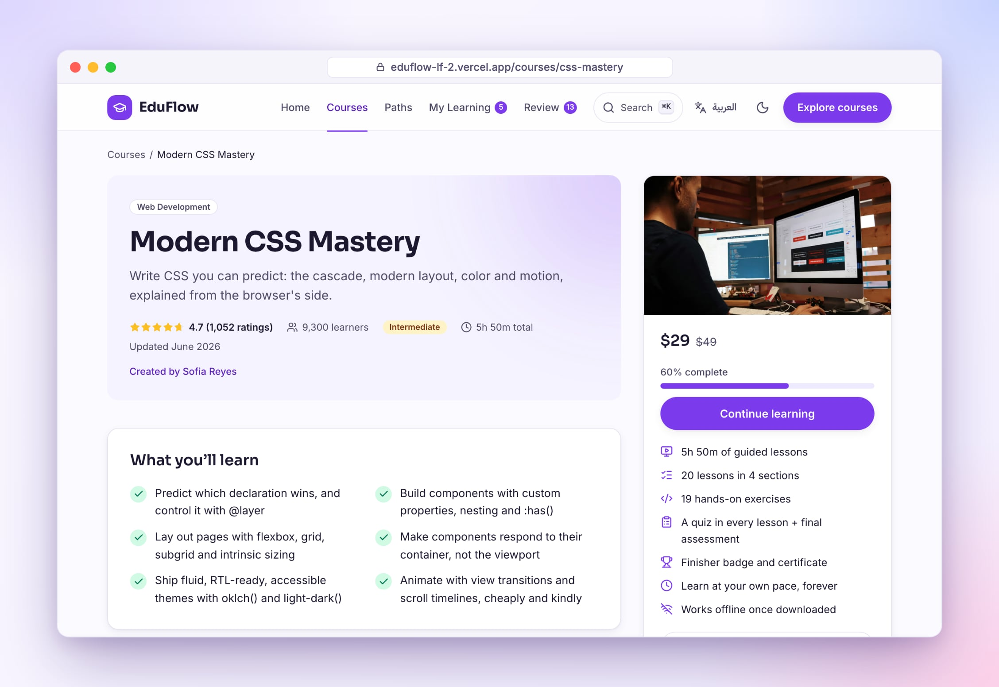
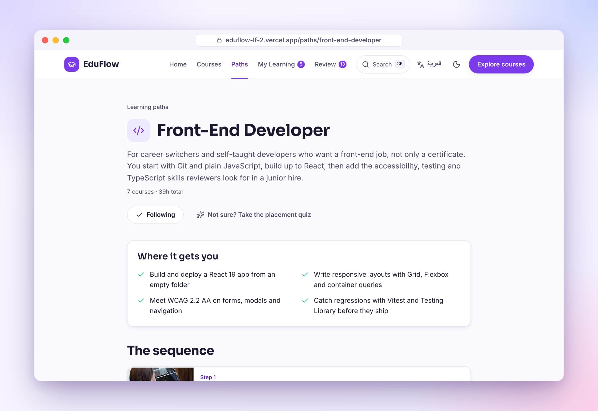
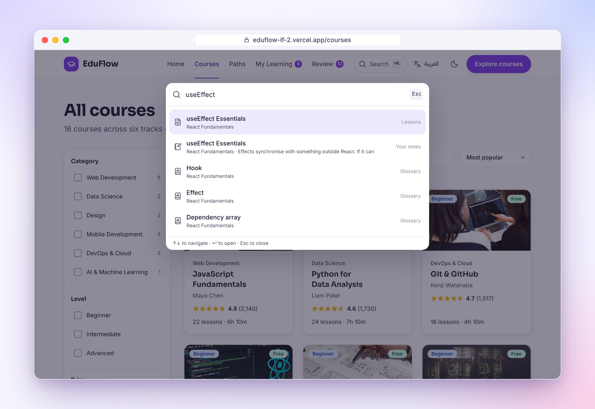

<div align="center">

<a href="https://eduflow-lf-2.vercel.app"></a>

# EduFlow

**Learn to code, analyse data and design — for free, in your browser, in English or Arabic.**

16 courses · 303 written lessons · 297 hands-on exercises · 1,630 quiz questions · works offline

[](https://eduflow-lf-2.vercel.app)
[](https://eduflow-lf-2.vercel.app/ar)


[Read this in Arabic · اقرأ بالعربية](README.ar.md)

<br>

<a href="https://eduflow-lf-2.vercel.app"></a>

<br><br>

### ▶ The 28-second reel

<video src="https://github.com/Ziad-AlHusseiny/eduflow/raw/main/docs/reel/eduflow-reel.mp4" poster="https://github.com/Ziad-AlHusseiny/eduflow/raw/main/docs/reel/reel-poster.jpg" width="320" controls muted playsinline></video>

<a href="docs/reel/eduflow-reel.mp4"></a>

<sub>Real screen recordings of the live site, an English voiceover, two AI shots made with Higgsfield (no people), edited in Remotion.</sub>

</div>

## Why EduFlow

Most "learn to code" sites are either a wall of videos or a paywall. EduFlow is neither:

- **Every lesson is written to be read.** 600–1,200 words each, with worked examples, highlighted code, diagrams, common mistakes and key takeaways. Nothing to sit through.
- **You practise as you go, right in the page.** A React/HTML/CSS/JavaScript playground with automatic checks, real **SQLite** for the SQL course, real **Python with pandas and scikit-learn** for the data courses, TypeScript type challenges and write-the-tests exercises. No installs.
- **It makes you remember.** Every quiz explains every answer. Terms you've learned come back as flashcards on a spaced-repetition schedule.
- **It keeps you going.** Streaks, a weekly goal, XP and levels, 26 badges, stats, and a certificate at the end.
- **It's yours.** No account and no tracking: your progress lives in your browser, and you can export it, restore it or wipe it. It works offline, in English and in Arabic (right-to-left), in light or dark.

<p align="center">
  
</p>

## What you can learn

| Course | Track | Level | Lessons | You practise with |
|---|---|---|---:|---|
| [JavaScript Fundamentals](https://eduflow-lf-2.vercel.app/courses/javascript-fundamentals) | Web | Beginner | 22 | JavaScript + DOM playground |
| [React Fundamentals](https://eduflow-lf-2.vercel.app/courses/react-fundamentals) | Web | Beginner | 18 | Live React playground |
| [Modern CSS Mastery](https://eduflow-lf-2.vercel.app/courses/css-mastery) | Web | Intermediate | 20 | HTML/CSS playground |
| [Web Accessibility in Practice](https://eduflow-lf-2.vercel.app/courses/web-accessibility) | Web | Intermediate | 18 | DOM playground + guided audits |
| [Testing JavaScript Apps](https://eduflow-lf-2.vercel.app/courses/testing-javascript) | Web | Intermediate | 18 | Write the tests; they must catch planted bugs |
| [Advanced TypeScript Patterns](https://eduflow-lf-2.vercel.app/courses/advanced-typescript) | Web | Advanced | 22 | Type challenges checked by the real compiler |
| [Python for Data Analysis](https://eduflow-lf-2.vercel.app/courses/python-data-analysis) | Data | Beginner | 24 | Python + pandas in the browser |
| [SQL for Analysts](https://eduflow-lf-2.vercel.app/courses/sql-for-analysts) | Data | Intermediate | 16 | SQLite on a realistic store database |
| [Machine Learning Crash Course](https://eduflow-lf-2.vercel.app/courses/ml-crash-course) | AI | Intermediate | 23 | Python + scikit-learn in the browser |
| [UI Design with Figma](https://eduflow-lf-2.vercel.app/courses/figma-ui-design) | Design | Beginner | 17 | Guided design exercises |
| [Design Systems That Scale](https://eduflow-lf-2.vercel.app/courses/design-systems) | Design | Advanced | 19 | Tokens in a CSS playground + guided |
| [Build Mobile Apps with React Native](https://eduflow-lf-2.vercel.app/courses/react-native-apps) | Mobile | Intermediate | 21 | JavaScript playground + guided |
| [Swift Essentials for iOS](https://eduflow-lf-2.vercel.app/courses/swift-essentials) | Mobile | Beginner | 15 | Guided exercises |
| [Git & GitHub](https://eduflow-lf-2.vercel.app/courses/git-github) | DevOps & Cloud | Beginner | 16 | Guided exercises |
| [Docker & Kubernetes](https://eduflow-lf-2.vercel.app/courses/docker-kubernetes) | DevOps & Cloud | Intermediate | 20 | Guided exercises |
| [AWS Cloud Foundations](https://eduflow-lf-2.vercel.app/courses/aws-cloud-foundations) | DevOps & Cloud | Beginner | 14 | Guided exercises |

Not sure where to start? Take the [placement quiz](https://eduflow-lf-2.vercel.app/placement), or follow a **learning path**: Front-End Developer, Data Analyst, Product Designer, Mobile Developer, Cloud Engineer or Machine Learning Engineer.

> Every course is free to take. The prices, ratings and learner counts in the catalog are part of the demo storefront: no payment is ever asked for.

## A tour

### Lessons you can actually learn from



Highlighted code, diagrams, "common mistake" and "why it works" callouts, links to the official docs. Change the text size, switch on focus mode, bookmark, take notes, print. Keyboard shortcuts for everything (press <kbd>?</kbd> in a lesson). EduFlow remembers where you stopped reading.

### Practise for real, in the page


<table>
  <tr>
    <td width="50%"><br><b>SQL</b> runs in SQLite inside your browser, against a store database with customers, orders and products.</td>
    <td width="50%"><br><b>Python</b> runs pandas and scikit-learn in your browser (Pyodide). After the first run it works offline.</td>
  </tr>
</table>

Every exercise has hints, a reference solution with an explanation, and checks that tell you exactly what's still wrong. Your code is saved as you type. It all runs in a sandbox: nothing leaves your device, and an accidental infinite loop stops with an error instead of freezing the tab.

### Quizzes that teach, flashcards that stick

<table>
  <tr>
    <td width="50%"><br>A quiz at the end of every lesson, a checkpoint after every section, and a final assessment per course. <b>Every option explains why it's right or wrong.</b></td>
    <td width="50%"><br>The terms from lessons you've finished become <b>flashcards</b>. Five-box spaced repetition brings each one back just before you'd forget it.</td>
  </tr>
</table>

### Stay motivated


<table>
  <tr>
    <td width="50%"><br>26 badges, all earned from what you actually do</td>
    <td width="50%"><br>Finishing a course</td>
  </tr>
  <tr>
    <td width="50%"><br>Your stats, with charts you can also read as tables</td>
    <td width="50%"><br>A certificate when you finish every lesson and pass the final</td>
  </tr>
</table>

### Find your way

<table>
  <tr>
    <td width="50%"><br>Search, filter and sort. Every filter lives in the URL, so you can share it.</td>
    <td width="50%"><br>Every course page shows what you'll learn and the full curriculum.</td>
  </tr>
  <tr>
    <td width="50%"><br>Learning paths put the courses in order for a goal.</td>
    <td width="50%"><br>Press <kbd>⌘K</kbd> / <kbd>Ctrl K</kbd> to search lessons, glossary terms and your own notes.</td>
  </tr>
</table>

### English and Arabic, light and dark, desktop and phone


Every lesson, quiz, exercise and button exists in both languages. Arabic is laid out right to left, while code stays left to right.


Install it like an app. Press **Download for offline** on a course page and every lesson in it works on the train.

## Your data stays yours

There are no accounts, no servers and no analytics. Your enrollments, progress, notes and flashcards are stored in your browser's local storage. On the [Privacy page](https://eduflow-lf-2.vercel.app/privacy) you can export everything to a file, restore it on another device, or delete it all.

## By the numbers

| | |
|---|---|
| Courses | 16, in 6 tracks |
| Lessons | 303, about 216,000 words in English and 194,000 in Arabic |
| Questions | 1,073 lesson quiz + 365 checkpoint + 192 final assessment |
| Exercises | 297, plus 300 runnable code examples inside lessons |
| Glossary | 478 terms, which double as flashcards |
| Diagrams | 218 |
| Tests | 106 unit and content tests, 229 end-to-end tests with accessibility checks (desktop and mobile, both languages, both themes), and every runnable exercise solved for real |
| Speed | Every page is pre-rendered HTML; the heaviest page loads 179 KB of JavaScript (gzipped). Lighthouse on mobile (live site): 95–100 performance and 100 accessibility on the main pages |

## Under the hood

<details>
<summary><b>Stack and architecture</b></summary>

<br>

- **React 19, React Router 7, Vite 7, Tailwind CSS 4, Motion, lucide-react.** No backend.
- **Content as data.** Lessons are Markdown with YAML front matter (`content/<course>/lessons/*.{en,ar}.md`), exercises are JSON, assessments are YAML. `scripts/content/build.mjs` compiles them into per-lesson JSON with code highlighted at build time by Shiki, so reading a lesson ships no highlighter.
- **Pre-rendered.** All 448 routes are rendered to static HTML in both languages (896 pages) with `react-dom/static`, then hydrated. The page's chunk, text and content are loaded before hydration, so nothing flashes.
- **Sandboxed practice.** Learner code runs in a `sandbox="allow-scripts allow-forms"` iframe with no same-origin access. A harness captures the console and runs the checks, and loops are guarded. JSX compiles with Sucrase, TypeScript is type-checked by the real compiler, SQL runs in sql.js and Python in Pyodide, each in a worker. Every engine loads only when an exercise needs it.
- **State.** Small validated stores in `localStorage`, read with `useSyncExternalStore`. Progress, streaks, XP and badges are derived, never stored.
- **Offline.** A hand-written service worker precaches the app shell, caches lessons as you read them and downloads whole courses on request. Content is versioned by hash, so updates replace stale lessons.
- **Accessible.** Native `<dialog>`s, full keyboard support, reduced-motion support, labelled charts with table views, and axe checks on every page in both languages and themes.

</details>

<details>
<summary><b>Project structure</b></summary>

```text
content/            courses: lessons, exercises, assessments and glossaries in EN + AR
  catalog/          instructors, reviews, learning paths, placement quiz
  data/             the sample store database and CSVs for the SQL and Python courses
docs/               product docs, the content guide, review reports, build log, credits
e2e/                Playwright tests
scripts/
  content/          content build, validator, exercise checker
  readme-shots/     the pipeline that made the images in this README
  prerender.mjs     static HTML for every route, sitemap, service worker
src/
  components/       layout, lesson, practice (playground, SQL, Python), learning widgets
  lib/              stores, progress, streaks, XP, spaced repetition, quiz scoring, runners
  pages/            one per route
  i18n/             English and Arabic
```

</details>

## Run it locally

You need Node.js 20.19 or newer.

```bash
git clone https://github.com/Ziad-AlHusseiny/eduflow.git
cd eduflow
npm ci
npm run dev
```

| Command | What it does |
|---|---|
| `npm run dev` | Builds the content, then starts the dev server |
| `npm run build` | Content, client and pre-render builds into `dist/` |
| `npm run preview` | Serves `dist/` the way it's served in production |
| `npm test` | Unit and content-integrity tests (Vitest) |
| `npm run test:e2e` | End-to-end tests (Playwright), desktop and mobile |
| `npm run check:content` | Runs every exercise: solutions must pass, starters must fail |
| `npm run verify` | Lint, tests, build, bundle budget, exercise checks and e2e, in order |
| `npm run shots` | Re-creates the screenshots in this README (after `npm run build`) |

## Found a mistake in a lesson?

Please [open an issue](https://github.com/Ziad-AlHusseiny/eduflow/issues) with the lesson's link and what's wrong. Lesson sources are plain Markdown in `content/`, and [`docs/CONTENT-GUIDE.md`](docs/CONTENT-GUIDE.md) explains how they're written.

## Credits

Photos are from Unsplash and Pexels, and fonts and software are credited in [docs/CREDITS.md](docs/CREDITS.md). Instructors, reviews and learner numbers in the app are fictional. EduFlow is not an accredited education provider, and its certificates are not academic credentials.

Built by [Ziad Al-Husseiny](https://github.com/Ziad-AlHusseiny).
